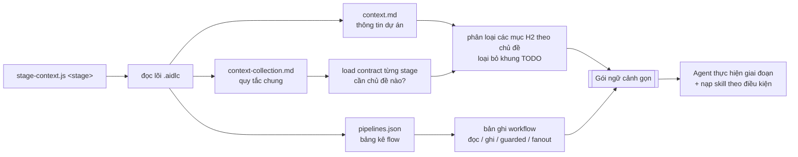

# AI-DLC Toolkit (`aidlc-src/`)

`aidlc-src/` là **bộ công cụ nguồn** cho quy trình phát triển dựa trên AI
(AI-Driven Development Lifecycle — AI-DLC) của dự án. Đây là một tập hợp
độc lập với framework gồm **định nghĩa agent**, **kỹ năng (skills) tái sử dụng**,
**mẫu ngữ cảnh (context templates)** và **trình trợ giúp runtime**, được
`setup-aidlc.sh` kết xuất (render) thành một quy trình làm việc sẵn dùng cho công
cụ AI coding của bạn (Claude Code, Cursor, Codex hoặc GitHub Copilot).

Ý tưởng cốt lõi: một tính năng hoặc một lần sửa lỗi được chia thành các **giai
đoạn (stages)** nhỏ, tách biệt (phân tích → thiết kế → lập kế hoạch → hiện thực →
kiểm thử → review). Mỗi giai đoạn chạy như một agent riêng với lát cắt ngữ cảnh
dự án nhỏ nhất cần thiết, chỉ đọc các sản phẩm (artifact) mà giai đoạn trước tạo
ra, và ghi ra một artifact chính cho giai đoạn kế tiếp. Cách này giúp mọi bước
đều có thể kiểm toán, truy vết, và tiết kiệm ngữ cảnh.

### `context.md` là ranh giới phạm vi (scope boundary)

Tệp quan trọng nhất là **`.aidlc/context.md`** (được khởi tạo từ
`templates/context.md`). Đây là nguồn sự thật (ground truth) của dự án — các
module thực tế, kiến trúc, các mẫu (pattern) data/UI, DI, lưu trữ, quy ước đặt
tên, bộ công cụ kiểm thử, và các vùng rủi ro cao. **Mọi giai đoạn đều được neo
vào tệp này.** Nhiệm vụ của nó là giữ cho AI *nằm bên trong dự án này*: xây dựng
dựa trên các module và pattern thực sự đang tồn tại ở đây, thay vì bịa ra kiến
trúc chung chung, kéo vào các thư viện mà dự án không dùng, hay đi nghiên cứu các
giải pháp nằm ngoài phạm vi đã xác lập của codebase.

Nếu một giai đoạn cần một thông tin mà `context.md` không đề cập, điều đó sẽ hiện
ra dưới dạng một **lỗ hổng ngữ cảnh (context gap)** — giai đoạn sẽ đánh dấu sự
không chắc chắn đó thay vì đoán mò. Vì vậy, chất lượng của mọi giai đoạn phía sau
lên xuống tùy theo mức độ chính xác mà `context.md` mô tả về dự án của bạn. Hãy
điền vào tệp này thật cẩn thận; đó là hàng rào bảo vệ ngăn pipeline trôi ra ngoài
phạm vi dự án.

```
aidlc-src/
├── toolkit.schema              # phiên bản tương thích (hiện tại là "4")
├── lib/
│   ├── render.js               # profile → thay thế {{PLACEHOLDER}}
│   ├── stage-context.js        # dựng gói ngữ cảnh gọn cho từng giai đoạn
│   └── figma-digest.js         # rút gọn phản hồi Figma REST lớn thành bản tóm tắt
└── templates/
    ├── context.md              # mẫu thông tin dự án  → .aidlc/context.md (khởi tạo một lần)
    ├── context-collection.md   # quy tắc workflow chung → .aidlc/context-collection.md
    ├── workspace.yaml          # sổ đăng ký agent/skill/pipeline dạng dễ đọc
    ├── agents/*.md             # 10 agent theo từng giai đoạn
    └── skills/*.md             # 17 kỹ năng nguyên tử, tái sử dụng
```

---

## 1. Cách hoạt động (bức tranh tổng thể)

Bộ công cụ là một **trình render mỏng bên trên các template**. Không có gì đặc
thù cho dự án bị viết cứng (hardcode) trong template; thay vào đó:

| Lớp | Tệp | Ai chỉnh sửa |
| --- | --- | --- |
| **Hồ sơ dự án (Project profile)** | `aidlc.project.json` | Bạn, một lần cho mỗi dự án |
| **Templates** | `aidlc-src/templates/**` | Tác giả toolkit (quy tắc là tệp thực) |
| **Trình render** | `setup-aidlc.sh` + `aidlc-src/lib/*` | Toolkit |
| **Kết quả sinh ra** | `.aidlc/**`, `CLAUDE.md`, `.claude/commands/**` | Sinh tự động — không sửa tay |
| **Artifact của ticket** | `output/<ticket>/**` | Do các giai đoạn tạo ra lúc chạy |

`setup-aidlc.sh` đọc profile, thay thế các `{{PLACEHOLDERS}}` trong template, và
ghi ra:

- `.aidlc/` — lõi runtime dùng chung (agents, skills, context, helpers, và một
  tệp `pipelines.json` máy đọc được);
- một **tệp quy tắc (rules file)** cho framework của bạn (`CLAUDE.md`,
  `.cursor/rules/aidlc.mdc`, `AGENTS.md`, hoặc `.github/copilot-instructions.md`);
- các **lệnh slash** cho từng giai đoạn (ví dụ `.claude/commands/study.md`).

> **Quan trọng:** `.aidlc/` được sinh lại sau mỗi lần chạy, nên hãy chỉnh sửa các
> **template** trong `aidlc-src/templates/` để thay đổi hành vi một cách bền vững
> — đừng sửa các tệp đã sinh ra. Ngoại lệ duy nhất là `.aidlc/context.md`, tệp
> này được **khởi tạo một lần và được giữ lại** để kiến thức dự án của bạn không
> mất khi sinh lại (buộc làm mới bằng `AIDLC_REFRESH_CONTEXT=1`).

---

## 2. Thiết lập (Setup)

### Yêu cầu trước

- **Node.js** (`node` trong `PATH`) — dùng để phân tích profile và render
  template. Không có bước `npm install`; các helper không phụ thuộc thư viện ngoài.
- Một công cụ AI coding được hỗ trợ: Claude Code, Cursor, Codex, hoặc GitHub Copilot.

### Sinh ra workspace

Từ thư mục gốc của dự án, chạy trình sinh với framework mục tiêu:

```bash
./setup-aidlc.sh claude          # → CLAUDE.md + .claude/commands/*.md
./setup-aidlc.sh cursor          # → .cursor/rules/aidlc.mdc + .cursor/commands/*.md
./setup-aidlc.sh codex           # → AGENTS.md + .codex/prompts/*.md
./setup-aidlc.sh copilot         # → .github/copilot-instructions.md + .github/prompts/*.prompt.md
./setup-aidlc.sh all             # → tất cả framework ở trên
```

Ở lần chạy đầu tiên, nếu thiếu `aidlc.project.json`, script sẽ tạo một tệp mặc
định và dừng lại để bạn điền vào. Hãy chỉnh sửa phần định danh, tech stack, ví dụ
ticket, và các bí danh model (model aliases) của nó, rồi chạy lại.

### Tinh chỉnh dự án (làm một lần)

1. **`aidlc.project.json`** — tên/package dự án, danh sách module, min/target SDK,
   ví dụ ticket, và các bí danh model (`heavy`/`mid`) mà mỗi giai đoạn sử dụng.
2. **`.aidlc/context.md`** — **ranh giới phạm vi** (xem phần trên). Hãy thay phần
   văn bản `TODO`/khung mẫu bằng module, kiến trúc, các pattern data/UI, DI, lưu
   trữ, quy ước đặt tên, bộ công cụ kiểm thử, và các vùng rủi ro cao thực tế của
   dự án bạn. Đây là hàng rào giữ cho các giai đoạn xây dựng dựa trên những gì
   đang tồn tại ở đây thay vì bịa ra hay nghiên cứu ngoài phạm vi dự án — nên độ
   chính xác ở đây quan trọng hơn bất kỳ thứ gì khác trong quá trình thiết lập.
   Các giai đoạn chỉ nạp những phần liên quan.

### Các biến môi trường hữu ích

| Biến | Tác dụng |
| --- | --- |
| `AIDLC_DEST` | Ghi kết quả sinh ra vào thư mục khác (mặc định là gốc repo) |
| `AIDLC_PROFILE` | Dùng profile khác thay cho `<dest>/aidlc.project.json` |
| `AIDLC_SRC` | Dùng một nguồn toolkit cụ thể (phải thỏa `toolkit.schema` 4) |
| `AIDLC_REFRESH_CONTEXT=1` | Sinh lại `.aidlc/context.md` từ template (ghi đè thông tin dự án) |
| `AIDLC_OUTPUT_DIR` | Ghi đè thư mục output của ticket (mặc định `output/<ticket>/`) |
| `AIDLC_FLOW` | Cố định flow id cho một giai đoạn (ví dụ `impl-flow`) |

---

## 3. Sử dụng pipeline

Mỗi giai đoạn là một **lệnh slash** giúp xác định thư mục ticket
(`output/<ticket>/`), nạp gói ngữ cảnh gọn của nó, đọc (các) artifact trước đó,
thực hiện công việc, và ghi ra artifact của chính mình.

### Các giai đoạn

| Lệnh | Agent | Đọc | Ghi | Model |
| --- | --- | --- | --- | --- |
| `/study` | feature-analysis | yêu cầu + thiết kế/API (tùy chọn) | `DEV-SPEC.md` | heavy |
| `/design` | solution-design | `DEV-SPEC.md` | `SOLUTION-DESIGN.md` | heavy |
| `/task` | implementation-plan | `SOLUTION-DESIGN.md` | `IMPLEMENT-PLAN.md` | mid |
| `/implement` | android-dev | `IMPLEMENT-PLAN.md` + `SOLUTION-DESIGN.md` (hoặc `BUG-INVESTIGATION.md`) | `CHANGESET.md` + code | mid |
| `/ut` | testing | `CHANGESET.md` | `UNIT-TEST-REPORT.md` + tests | mid |
| `/qa-plan` | qa-plan | `DEV-SPEC.md` | `TEST-CASES.md` | heavy |
| `/autotest` | automation-test | `CHANGESET.md` (hoặc `TEST-CASES.md`) | `AUTOMATION-TEST-REPORT.md` + test instrumented | mid |
| `/aidlc-review` | review | changeset + tests + design/plan | `CODE-REVIEW.md` | heavy |
| `/fixbug` | bug-investigation | báo cáo bug/crash | `BUG-INVESTIGATION.md` | heavy |
| `/discover` | discovery | phạm vi code | `FLOW-DISCOVERY.md` | heavy |

Chú thích từng lệnh — nó làm gì và ghi ra những gì:

- **`/study`** (feature-analysis) — Đọc yêu cầu (tài liệu BA / API, thiết kế Figma
  tùy chọn) và biến nó thành một bản đặc tả hiểu-yêu-cầu gọn, có gắn nguồn. **Chỉ
  phân tích, không thiết kế giải pháp.** → Ghi `DEV-SPEC.md`; các tệp đính kèm đã
  chuyển đổi vào `input/`; cache Figma cục bộ vào `figma/` (nếu cần).
- **`/design`** (solution-design) — Biến `DEV-SPEC.md` đã duyệt thành hợp đồng
  hành vi + kiến trúc: các thành phần, luồng dữ liệu, chuyển trạng thái, tiêu chí
  chấp nhận (AC). **Chỉ thiết kế, không viết code.** → Ghi `SOLUTION-DESIGN.md`
  (kèm `figma/`, `design/`, `screenshot/` tùy chọn).
- **`/task`** (implementation-plan) — Biến thiết kế thành backlog các hạng mục
  công việc dọc, chia nhỏ thành task có đường dẫn/symbol cụ thể, thứ tự phụ thuộc
  (DAG) và các đợt (waves). **Chỉ lập kế hoạch.** → Ghi `IMPLEMENT-PLAN.md`.
- **`/implement`** (android-dev) — Hiện thực các task đã duyệt theo đúng kiến trúc
  dự án; task rời chạy song song, bề mặt dùng chung chạy tuần tự. → Ghi
  `CHANGESET.md` (bảng kê thay đổi) **và mã nguồn thực** trong `app/`.
- **`/ut`** (testing) — Viết unit test (JVM/Room/Paging) xác định cho hành vi đã
  thay đổi và báo cáo trung thực kết quả chạy. → Ghi `UNIT-TEST-REPORT.md` + mã
  test dưới `src/test`.
- **`/qa-plan`** (qa-plan) — Biến tiêu chí chấp nhận thành bộ test case truy vết
  được (tích cực/tiêu cực/biên), đánh dấu case nào tự động hóa được. **Không viết
  code test.** → Ghi `TEST-CASES.md`.
- **`/autotest`** (automation-test) — Viết test instrumented/UI (Espresso/Compose)
  dưới `androidTest` và báo cáo trung thực kết quả chạy trên thiết bị. → Ghi
  `AUTOMATION-TEST-REPORT.md` + mã test dưới `src/androidTest`.
- **`/aidlc-review`** (review) — Review diff thực tế, truy vết yêu cầu ↔ test, và
  ra một kết luận Go/No-Go duy nhất. → Ghi `CODE-REVIEW.md`.
- **`/fixbug`** (bug-investigation) — Phân loại bug, xác định nguyên nhân gốc từ
  bằng chứng, và chỉ đề xuất task sửa khi đã xác nhận nguyên nhân. **Chỉ điều tra,
  không hiện thực.** → Ghi `BUG-INVESTIGATION.md`; đính kèm đã chuyển đổi vào `input/`.
- **`/discover`** (discovery) — Dịch ngược một luồng đang tồn tại từ điểm vào qua
  luồng gọi/dữ liệu đến điểm ra, ghi lại code đúng như hiện trạng. **Chỉ đọc.** →
  Ghi `FLOW-DISCOVERY.md`.

Hai **flow tự động** xâu chuỗi các giai đoạn từ đầu đến cuối, không có chốt duyệt
của con người:

- **`/vibe`** — tính năng: phân tích → thiết kế → kế hoạch → hiện thực → kiểm thử → autotest → review.
- **`/qa`** — kiểm thử hành vi từ một yêu cầu (không viết code production): phân tích → qa-plan → autotest → review.

### Chạy thủ công một giai đoạn

Chỉ cần gọi lệnh và cung cấp ticket id cùng bất kỳ input bắt buộc nào, ví dụ:

```
/study DNLW-123      (rồi cung cấp tài liệu BA / API doc khi được hỏi)
/design DNLW-123
/task DNLW-123
/implement DNLW-123
```

Mỗi lệnh mang theo một **hợp đồng input (input contract)** và sẽ hỏi những gì bạn
bỏ trống — nó không bao giờ tự bịa ticket id, đường dẫn, hay nhánh (branch).

### Các flow pipeline có tên

`pipelines.json` (được sinh ra) định nghĩa các flow thực thi mà bộ điều phối
(orchestrator) và `/vibe` / `/qa` sử dụng:

| Flow | Các bước |
| --- | --- |
| `impl-flow` | feature-analysis → solution-design → implementation-plan → android-dev → testing → automation-test → review |
| `auto-feature-flow` | feature-analysis → solution-design → implementation-plan → android-dev (dừng ở code) |
| `fixbug-flow` | bug-investigation → android-dev → testing → review |
| `fixcrash-flow` / `auto-bug-flow` | bug-investigation → android-dev (dừng ở code) |
| `qa-flow` | feature-analysis → qa-plan → automation-test → review |
| `discover-flow` | discovery |
| `automation-test-flow` | automation-test |
| `techlead-review-flow` | review (diff/branch độc lập) |

**Các flow có canh gác (guarded flows)** (`impl-flow`, `auto-*`, `fixbug-flow`,
`qa-flow`) yêu cầu dòng đầu tiên của mỗi artifact phải là `AUTOMATION: CONTINUE`
hoặc `AUTOMATION: STOP — <lý do>`. Một giai đoạn sẽ dừng khi input thiếu/mâu
thuẫn, tiêu chí chấp nhận không kiểm thử được, nguyên nhân bug chưa được xác nhận,
hoặc khi đụng đến công việc được bảo vệ (xác thực, thanh toán, bảo mật, migration
hủy dữ liệu, đồng bộ realtime/offline, navigation/DI/state dùng chung, hoặc logic
build).

### Cấu trúc thư mục `output/<ticket>/` theo từng flow

Mỗi flow tích lũy các artifact vào cùng một thư mục ticket, theo thứ tự các giai
đoạn. Các artifact tồn tại xuyên suốt để bước sau đọc bước trước và để truy vết.

**`impl-flow`** (`/vibe`) — hiện thực một tính năng từ đầu đến review:

```
output/DNLW-123/
├── input/                    # tệp đính kèm đã chuyển đổi (nếu ticket có)
├── figma/                    # cache Figma cục bộ (nếu có thiết kế) — manifest + digest + screenshot
├── DEV-SPEC.md               # (1) /study      — feature-analysis
├── SOLUTION-DESIGN.md        # (2) /design     — solution-design
├── IMPLEMENT-PLAN.md         # (3) /task       — implementation-plan
├── CHANGESET.md              # (4) /implement  — android-dev (mã nguồn ghi thẳng vào app/)
├── UNIT-TEST-REPORT.md       # (5) /ut         — testing
├── AUTOMATION-TEST-REPORT.md # (6) /autotest   — automation-test
└── CODE-REVIEW.md            # (7) review      — kết luận Go / No-Go
```

**`fixbug-flow`** — điều tra rồi sửa một bug, có kiểm thử và review:

```
output/FIXBUG-1/
├── input/                    # log / trace / đính kèm đã chuyển đổi (nếu có)
├── BUG-INVESTIGATION.md      # (1) /fixbug     — bug-investigation (chẩn đoán + task sửa)
├── CHANGESET.md              # (2) /implement  — android-dev (áp bản sửa vào app/)
├── UNIT-TEST-REPORT.md       # (3) /ut         — testing
└── CODE-REVIEW.md            # (4) review      — kết luận Go / No-Go
```

**`qa-flow`** (`/qa`) — kiểm thử hành vi từ một yêu cầu, **không viết code production:**

```
output/DNLW-123/
├── input/                    # tệp đính kèm đã chuyển đổi (nếu có)
├── DEV-SPEC.md               # (1) /study      — feature-analysis (tiêu chí chấp nhận)
├── TEST-CASES.md             # (2) /qa-plan    — qa-plan (bộ test case, đánh dấu tự-động-hóa-được)
├── AUTOMATION-TEST-REPORT.md # (3) /autotest   — automation-test (mã test dưới src/androidTest)
└── CODE-REVIEW.md            # (4) review      — ký duyệt độ phủ so với tiêu chí
```

> Thư mục ticket được xác định một lần: dùng `$AIDLC_OUTPUT_DIR` nếu được đặt,
> ngược lại là `output/<ticket>/`. Các flow dừng-ở-code (`auto-feature-flow`,
> `fixcrash-flow`, `auto-bug-flow`) tạo cùng các tệp như trên nhưng dừng lại ở
> `CHANGESET.md` (không có test/review).

---

## 4. Cách ngữ cảnh được chọn lọc (phần thông minh)

Các giai đoạn không bao giờ nạp toàn bộ các tệp ngữ cảnh. Trước khi làm việc, mỗi
giai đoạn chạy:

```bash
node .aidlc/lib/stage-context.js <stage> --flow <flow-id> --ticket-dir <folder>
```

`stage-context.js` đọc ba tệp lõi (`context.md`, `context-collection.md`,
`pipelines.json`) và phát ra một **gói gọn (compact packet)** chỉ chứa:

- **quy tắc nền tảng (ground rules) + định danh dự án** (luôn luôn có);
- các **chủ đề dự án** mà giai đoạn này cần, theo bảng "Per-stage load contract"
  trong `context-collection.md` (ví dụ: thiết kế đọc *modules, architecture, UI,
  data, DI, storage, naming, high-risk*; kiểm thử đọc *architecture, data, UI
  state, test tooling, high-risk*);
- **bản ghi workflow** của giai đoạn từ `pipelines.json` — nó đọc gì, ghi gì, có
  được phân tán (fan out) hay không, và flow có được canh gác (guarded) hay không;
- bất kỳ **lỗ hổng ngữ cảnh (context gaps)** nào (các `TODO` chưa giải quyết,
  phần bị thiếu) để giai đoạn biết chỗ nào còn chưa chắc chắn.

Đây là lý do các giai đoạn luôn gọn nhẹ và tập trung: một trình phân tích nhận
biết khung mẫu sẽ loại bỏ văn bản `TODO`, phân loại từng phần của `context.md`
theo chủ đề, và chỉ đưa cho giai đoạn những phần mà hợp đồng nạp (load contract)
của nó yêu cầu. Kết quả là tệp quy tắc luôn-được-nạp vẫn nhỏ, trong khi mỗi giai
đoạn vẫn nhận đúng những thông tin dự án nó cần.

**Và đó là lý do `context.md` là ranh giới phạm vi trong thực tế:** gói mà một
giai đoạn nhận được được dựng *từ* `context.md`, nên giai đoạn sẽ lập luận dựa
trên các module, ranh giới và vùng rủi ro cao thực tế của bạn — chứ không phải
một ứng dụng Android chung chung. Một thông tin vắng mặt trong `context.md` sẽ
nổi lên thành một **context gap** mà giai đoạn phải đánh dấu, thay vì lấp đầy
bằng cách đoán mò hay nghiên cứu ngoài dự án. Bất cứ điều gì bạn để mơ hồ,
pipeline coi là chưa biết; bất cứ điều gì bạn nêu rõ, nó coi là luật của codebase
này.

### Skills — hướng dẫn nguyên tử, nạp theo điều kiện

Các agent được thiết kế cố ý mỏng. Các năng lực tái sử dụng nằm trong
`skills/*.md` và **chỉ được nạp khi một điều kiện kích hoạt (trigger) cụ thể được
thỏa mãn** (không bao giờ nạp cho "đủ bộ"):

| Skill | Nạp trong… | Làm gì |
| --- | --- | --- |
| `ticket-reading` | feature-analysis, bug-investigation | Chuẩn hóa tệp ticket; trích một bản ghi có gắn nguồn |
| `codebase-search` | discovery, feature-analysis, bug-investigation | Định vị bằng chứng code tối thiểu (điểm vào, hành vi hiện tại) |
| `api-analysis` | discovery, feature-analysis, solution-design | Quan sát các hợp đồng API hiện có khi công việc đụng đến networking |
| `architecture-analysis` | discovery, solution-design, review | Làm rõ các lớp, module, đấu nối DI, quyết định bộ công cụ UI |
| `dependency-analysis` | phần lớn các giai đoạn phân tích | Bản đồ ảnh hưởng có giới hạn cho một symbol hoặc diff đã xác nhận |
| `reuse-detection` | feature-analysis, solution-design, android-dev | Tìm các scaffold/UI/use-case/repo/mapper hiện có tương thích |
| `risk-analysis` | phân tích, thiết kế, kế hoạch, review | Rủi ro có bằng chứng trong code bị đụng đến |
| `design-intent-analysis` | feature-analysis | Trích ý đồ sản phẩm nhìn thấy được từ một thiết kế được cung cấp |
| `figma-fetch` | feature-analysis, solution-design | Tải một URL Figma từ xa **một lần** mỗi ticket → cache + bản tóm tắt |
| `feature-clarification` | feature-analysis | Chỉ giải quyết các điểm mơ hồ trọng yếu (≤5 câu hỏi) |
| `dev-spec-validation` | feature-analysis | Cổng chất lượng chỉ-báo-lỗi trước khi bàn giao DEV-SPEC |
| `bug-root-cause` | bug-investigation | Phân loại tác động; truy vết log/crash/ANR đến nguyên nhân |
| `regression-analysis` | bug-investigation, testing, review | Suy ra danh sách kiểm tra lại cho hành vi có thể bị ảnh hưởng |
| `planning` | implementation-plan | Biến thiết kế thành các hạng mục công việc dọc có truy vết + các đợt (waves) |
| `compose-guideline` | android-dev | Tham chiếu Compose UI (state, effects, recomposition) |
| `room-guideline` | android-dev | Tham chiếu Room (query, migration, dispatching, tests) |
| `paging-guideline` | android-dev | Tham chiếu Paging 3 (ranh giới, load states, caching) |
| `review-checklist` | review | Kiểm tra diff: kiến trúc, runtime, bảo mật, hiệu năng |

### Khả năng truy vết (Traceability)

Mỗi artifact giữ lại một chuỗi ID để người review có thể theo dõi một yêu cầu đi
suốt tới kết luận review:

```
Tính năng: FR-ID → SC-ID → AC-ID → Work-ID/Story-ID → Task-ID → đường dẫn thay đổi → Test-ID → trạng thái review
Bug:       ticket → fix Task-ID → đường dẫn thay đổi → testing Task-ID → Test-ID → trạng thái review
```

---

## 5. Sơ đồ tuần tự — flow tính năng (`/vibe`)

Sơ đồ này minh họa một lần chạy `impl-flow` có canh gác: mỗi giai đoạn dựng gói
ngữ cảnh của nó, đọc artifact trước đó, ghi ra artifact của chính mình, và dấu
`AUTOMATION: CONTINUE/STOP` làm chốt cho việc bàn giao sang giai đoạn kế tiếp.

> **Bản draw.io:** [xem trên Google Drive](https://drive.google.com/file/d/1wvRhUzFTDXEvRpmNKVdKXEYIgHq1f3Bp/view?usp=sharing)
> · nguồn: [`docs/feature-flow.drawio`](docs/feature-flow.drawio)

[](https://drive.google.com/file/d/1wvRhUzFTDXEvRpmNKVdKXEYIgHq1f3Bp/view?usp=sharing)

### Cách phân giải stage-context (phóng to)

Cách một giai đoạn biến ba tệp thành một gói tối thiểu:



---

## 6. Mở rộng bộ công cụ

- **Thay đổi hành vi của một giai đoạn** → sửa `templates/agents/<stage>.md`, chạy
  lại `setup-aidlc.sh`.
- **Thêm/điều chỉnh hướng dẫn tái sử dụng** → sửa hoặc thêm `templates/skills/*.md`
  và đấu nối nó vào bảng trigger của agent liên quan. Các tệp skill đã bị loại bỏ
  sẽ được dọn khỏi `.aidlc/` tự động.
- **Thay đổi thông tin dự án nào mà một giai đoạn nhìn thấy** → sửa bảng "Per-stage
  load contract" trong `templates/context-collection.md`.
- **Thay đổi các flow / thứ tự giai đoạn** → sửa logic `flow_steps` / `STAGES`
  trong `setup-aidlc.sh` (nó sinh ra `pipelines.json`).
- **Nâng cấp toolkit** → tệp `toolkit.schema` kiểm soát tính tương thích; trình
  sinh sẽ từ chối chạy trên một nguồn cũ hoặc không đầy đủ.

Sau bất kỳ thay đổi template nào, hãy chạy lại `./setup-aidlc.sh <framework>` để
sinh lại. Các thông tin dự án trong `.aidlc/context.md` của bạn được giữ nguyên.
